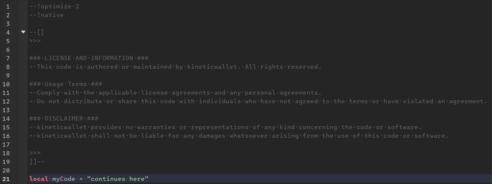

# Roblox Ownership Information

## Information

- This repository or any of its belongings has nothing to do with official Roblox.
- This a **community** template that you can use in your code to increase people's awareness.

## How To Use

1. You need a tool like [`darklua`](https://github.com/seaofvoices/darklua) that allows to insert the content of a file into each of your scripts/files.
2. Fetch the content of the [`template.txt`](https://raw.githubusercontent.com/kineticwallet/roblox-ownership-information/master/template.txt) and store them locally.
3. Add the `append_text_comment` rule to your `XYZ.darklua.json` configuration and define the local copy in the `file` field.
4. Run `darklua process X Y -c XYZ.darklua.json` and done, everything is updated.
5. Follow all the rules/information stated.

## Preview

*Your script(s) or code may ultimately resemble the content of this template.*

## License

- This repository is licensed under the **MIT** License.
